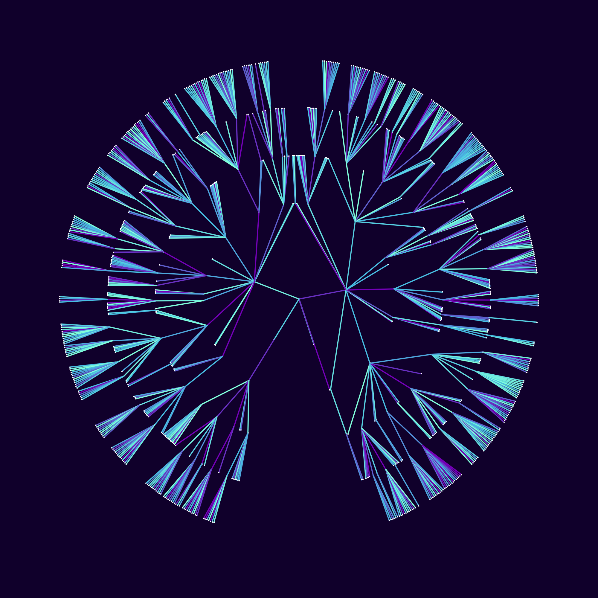
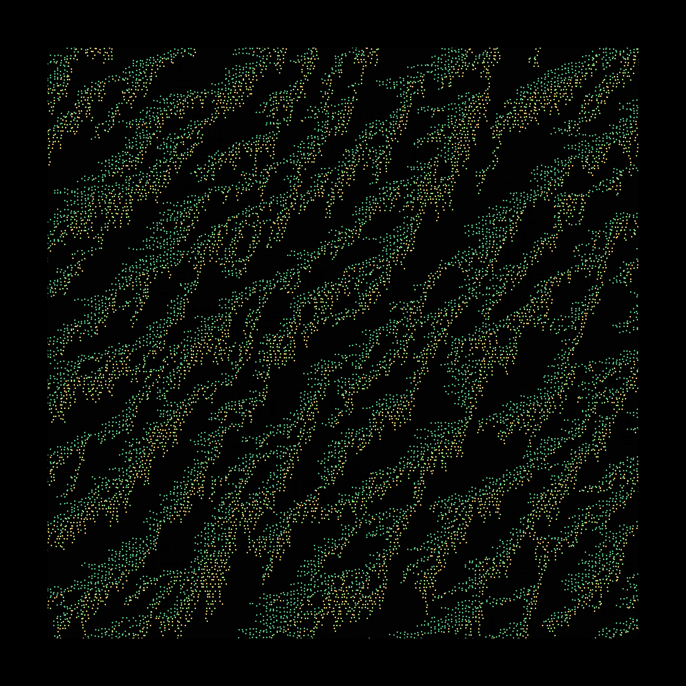
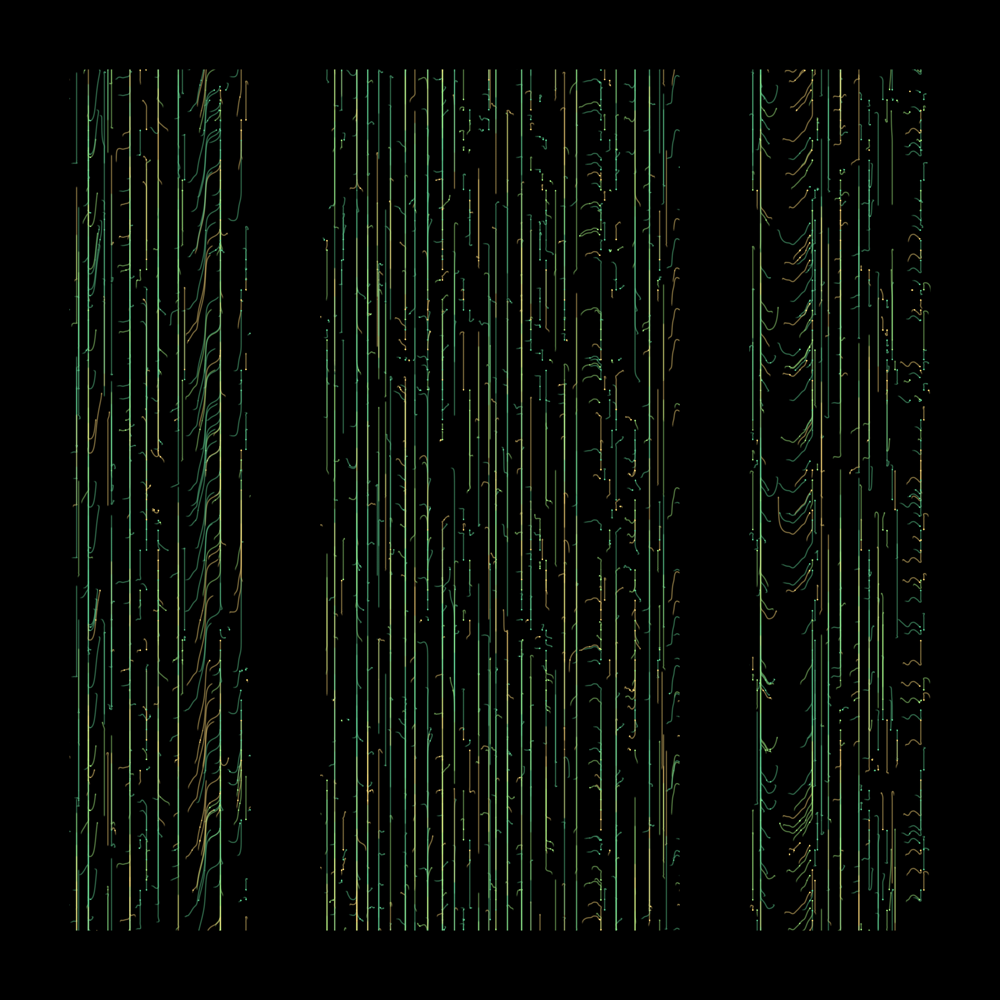
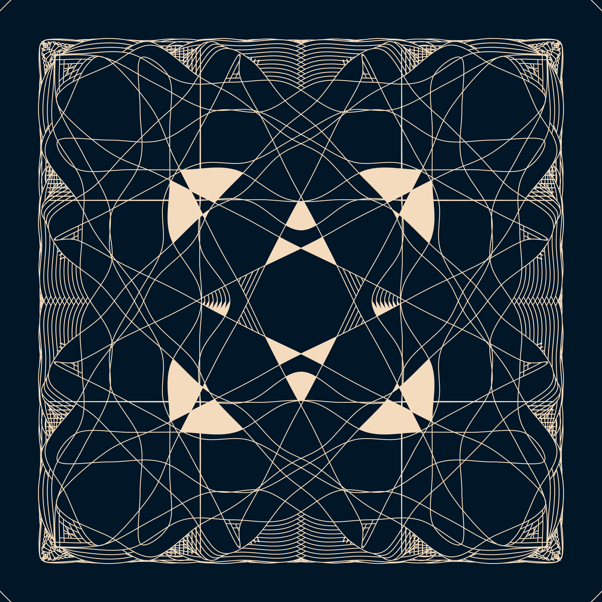

# p5.Fresco
`p5.Fresco` for p5.js is a collection of tools for procedural art generation. It mostly focuses on handling 2D shapes, particle systems, noises and physics in p5.js.
Full documentation can be found [here](https://nielspichon.github.io/p5.Fresco)

## Generate the [documentation](https://nielspichon.github.io/p5.Fresco)
The documentation is generated using [jsdoc](https://github.com/jsdoc/jsdoc).

Build documentation by running `gen_docs.sh` or with

```
jsdoc -r ./js -R README.md -d ./docs
```

## [Demos](./demos)

You can find a template for your own creations [here](./demos/demoTemplate/).

Bellow are a collection of pieces all created leveraging the Fresco.p5 and the native p5.js APIs.

### [Peacock](./demos/peacock/peacock.js)

Recursivity is a very powerful tool for procedural art. It allows from a very little set of rules to obtain seamingly
complex resuls. This is the case for instance with this circular recursive tree. Each branch gives birth to a series of branches, each of which give birth to a series of branch and so on. When time comes to draw, the weight of a branch, and thus
the space it takes in the canvas is computed as the sum of that of all the sub branches. Animating the maximum allowed angle for the root branch and the size of each branch we obtain this peacock trying to woo the viewer.



### [Lifeblood, Electronic Jungle and Electronic Sheep](./demos/lifeblood/lifeblood.js)

We found the Biham–Middleton–Levine traffic model on Wikipedia's math portal. Essentially 2 sets of particles are moved in one or the other direction.
If the spot where the particle should move is taken, the particle stops, until it is freed. Playing with the density of particles we can obtain a variety of emerging structures.
This idea of emerging order from chaos is something that really caught our attention.



Now you can also, in a perlin flow manner, add some noise to the velocity of the particles. Noise types also give radically different results. Interestingly, more noise will
allow for a higher particle amount without traffic jams forming, while resulting traffing jams will have less coherent forms.




### [Bandana](./demos/bandana/bandana.js)

This demo started as a water ripples generator. The idea is to have a circle, described as splines between a series of points. The circle grows until any point
encounters a point and then it reflects. With a very low resolution of the circle (e.g. 5 points) we get something that vaguely resembles the natural phenomenon
of ripples along thesurface of a lake bounding of the bank. However, because our ripples never fade, they start to create interesting patterns. By increasing the
resolution, because the distance between the points of the circle will grow over time, we soon get some grid like patterns. Forcing this trait further by cutting
the circle in 2 halves, with a different fill, one of the color of the background and the other of the water front color, we finally got some bandana motif looking
patterns.
We have also implemented the possibility to add noise to the points' velocity, as well as give each point a random starting velocity, which also give interesting
results, but because it breaks the symmetry, the results are less hypnotic. 



### [Windows to the soul](./demos/darkField/darkField.js)

Playing with shape particle emitters and some noise field to displace particles. Loads of different effects can be obtained with minimal parameter tweaks. 
We're super excited about what we'll turn out. More in this series to come... 


### [Buddha](./demos/buddha/buddha.js)

Scattering points on a sphere and then moving then along some ridged noise projected on the sphere gave the following buddha looking picture.
Tweaking the parameters give many interesting results that can be explored.


### [Boobs](./demos/boobs/boobs.js)

Generating some cute boobs with some randomized colors, and arc properties


### [Breathing](./demos/breathing/breathing.js)

Inspired by the cardioid video from D. Shiffman over at the [coding train](https://www.youtube.com/watch?v=bl3nc_a1nvs),
Each line starts at the same point and links another point on the circle. Then each line is subdivided
and each new vertex is displaced based on underlying perlin noise.


### [Butterfly, Roses, and ondulations](./demos/butterfly/butterfly.js)

Many concentric circles, with various opacity, each deformed following some noise.
Depending on the displacement amplitude, we can have very different renders, from butterflies,
to roses and ondulating, soothing shapes.


### [Dunes](./demos/hillsAndDunes/dunes.js)

Just playing with moving around a sine wave (or to be precise the absolute value of a sine wave) laterally
while pushing it down. Again, offset and noise amplitude, as well as color and opacity, or even adding a bit
of "shadow" can lead to radically different results. Our favourite results are when the period of the oscillations are very large,
with some light shadow and large noise. This creates some dreamy dunes.


### [Mantis](./demos/mantis/mantis.js)

This project started as a tree generator. When turning symmetry on, we realised that it generated shapes evoquing animal faces, and insects, 
with an African tribal mask feel to them. After a bit of tweaking, we managed to round off the "trees" to create smoother shapes. This mantis 
is a very nice example of a both minimal and yet rich piece.  


### [Perlin flow, Brain and Moon](./demos/perlinFlowField/perlinFlowField.js)

Scattering particles and letting them drift along some noise field is always very fun. Playing with noise type, noise transformation
(curl, distortion, ridging...) and amplitude of the noise field influence on the particles gives many different worlds to explore. Some examples include 
the "brain" and the "moon" below.


### [Ribs](./demos/ribs/ribs.js)

One of the early works we made, ribs is leveraging the need of the brain to see patterns. Playing on periodic opacity 
changes and width of some arcs, we managed to get this
peaceful work, which can be animated for great, almost trippy, effects.


### [Sailors](./demos/sailors/sailors.js)

This work is inspired by the work of [Julien Gachadoat](https://www.instagram.com/p/CJqau6dHQRV/) who made very nice drawings where
a circle is suggested to the viewer by the addition of chaos under the form of sine waves. This work takes the revert approach where
each row of the image will receive a sine wave with increasing frequency as we go down the image. For each row the phase is randomized,
giving the effect of looking at the sea. Once this is done, each point along the sine wave has its position checked against some shapes,
in our case a collection of triangles and half shapes, and if the point is inside, it is flatten to the row height. This in turn draws a
small boat as the only peaceful point of focus in a sea of chaos.


### [Sevilla](./demos/sevilla/sevilla.js)

One of the recurrent themes we like to explore with the Fresco.p5 library is that of distorting shapes with noise. Here, we draw strips of lines, 
displacing only the bottom half of the picture (we have added some fade to the displacement magnitude based on the pixels y coordinates to avoid so
harsh distortion line). The result is a motif which ressembles the erratic fabric movements of the flamenco dancers you can sometimes see in the 
streets of Sevilla.


### [Theatre](./demos/theatre/theatre.js)

We wanted to try and draw a piece which resembles the old school theatre decor, with its waves and clouds hand crafted with papier maché, and,
always, some discernable love for the craft. For the clouds, we draw some rectangular giggly lines which we then round the corners off. Lots of
trial and error here went into making sure the clouds actually close correctly. Add some shadows, some concentric half circles for the waves, 
animated with some simple horizontal offset, and an extra particle system for some soft rain, and you get something which hopefully captures some
of the feeling of these old decors.


### [Holi](./demos/holi/holi.js)

This project started as an attempt to make a physarum inspired work, somewhat like [Sage Jenson's work](https://www.sagejenson.com/physarum).
Because we have always been too lazy to pickup shaders
we decided to embrace the limitation of running on CPU and went for a low res grid. Interestingly with enough particles/agent/physarum organisms, and the right
color, the piece ended up looked like a colored chalk cloud, evocing the Indian festival Holi which celebrates spring (I think?).

On the tech side, we have a grid with a number of "compounds", each having a density of 0 to 1 in each cell. These diffuse and evaporate over time.
Then a number of "agents"/physarum organism move such that they always try to go towards what they think is best for them. This notion of "best" is very personal:
each agent is either a hater or a lover. Lovers will always go towards the (randomly selected) max density of compound they love, haters avoid it. Often time, the results
were better with having only haters or only lovers. Should we see some hidden meaning here? ^^


## Known issue
We are trying really hard to resolve bugs as they come but if you find somes, feel free to open an issue for it. The currently open bugs are:
* `isInside` has glitches which register points at the vertical of some corners as inside the shape when they should not be.