# p5.Fresco
`p5.Fresco` for p5.js is a collection of tools for procedural art generation. It mostly focuses on handling 2D shapes, particle systems, noises and physics in p5.js.
Full documentation can be found [here](https://nielspichon.github.io/p5.Fresco)

## Generate the [documentation](https://nielspichon.github.io/p5.Fresco)
The documentation is generated using [jsdoc](https://github.com/jsdoc/jsdoc).

Build documentation by running `gen_docs.sh` or with

```
jsdoc -r ./js -R README.md -d ./docs
```

## [Demos](./demos)

Bellow are a collection of pieces all created leveraging the Fresco.p5 and the native p5.js APIs.

### [Buddha](./demos/buddha/buddha.js)

Scattering points on a sphere and then moving then along some ridged noise projected on the sphere gave the following buddha looking picture.
Tweaking the parameters give many interesting results that can be explored.

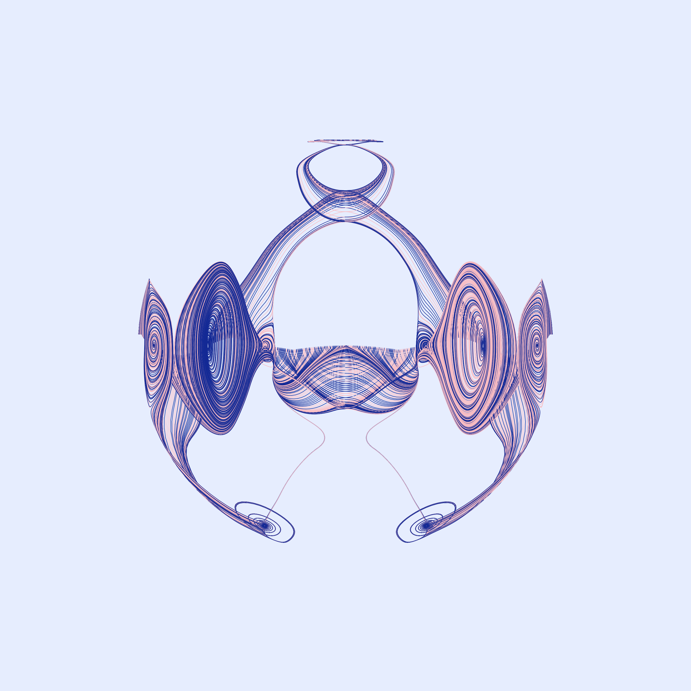

### [Boobs](./demos/boobs/boobs.js)

Generating some cute boobs with some randomized colors, and arc properties

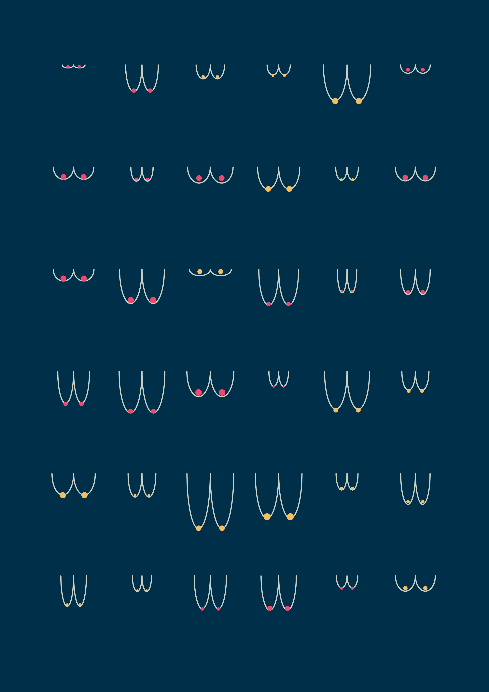

### [Breathing](./demos/breathing/breathing.js)

Inspired by the cardioid video from D.Shiffman over at the coding train,
Each line starts at the same point and links another point on the circle. Then each line is subdivided
and each new vertex is displaced based on underlying perlin noise.

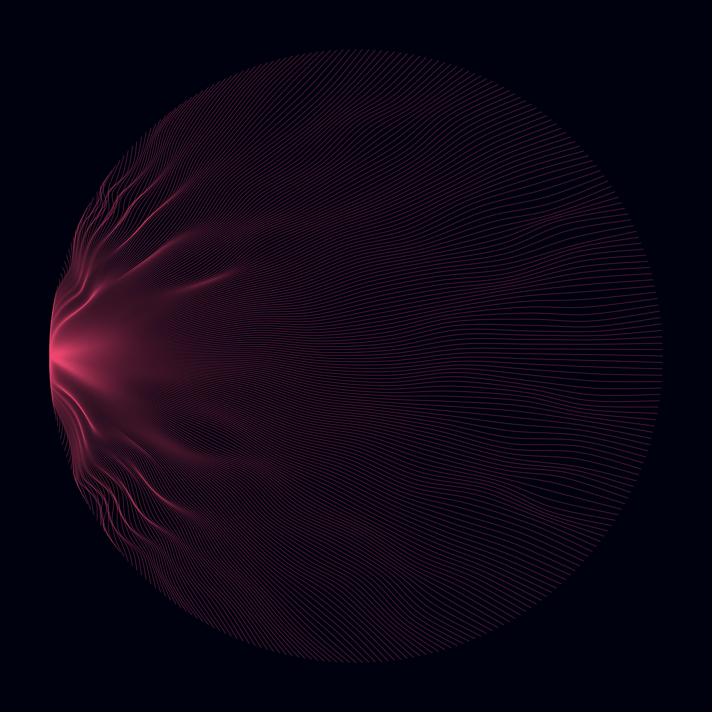

### [Butterfly, Roses, and ondulations](./demos/butterfly/butterfly.js)

Many concentric circles, with various opacity, each deformed following some noise.
Depending on the displacement amplitude, we can very different renders, from butterflies,
to roses and ondulating, soothing shapes.

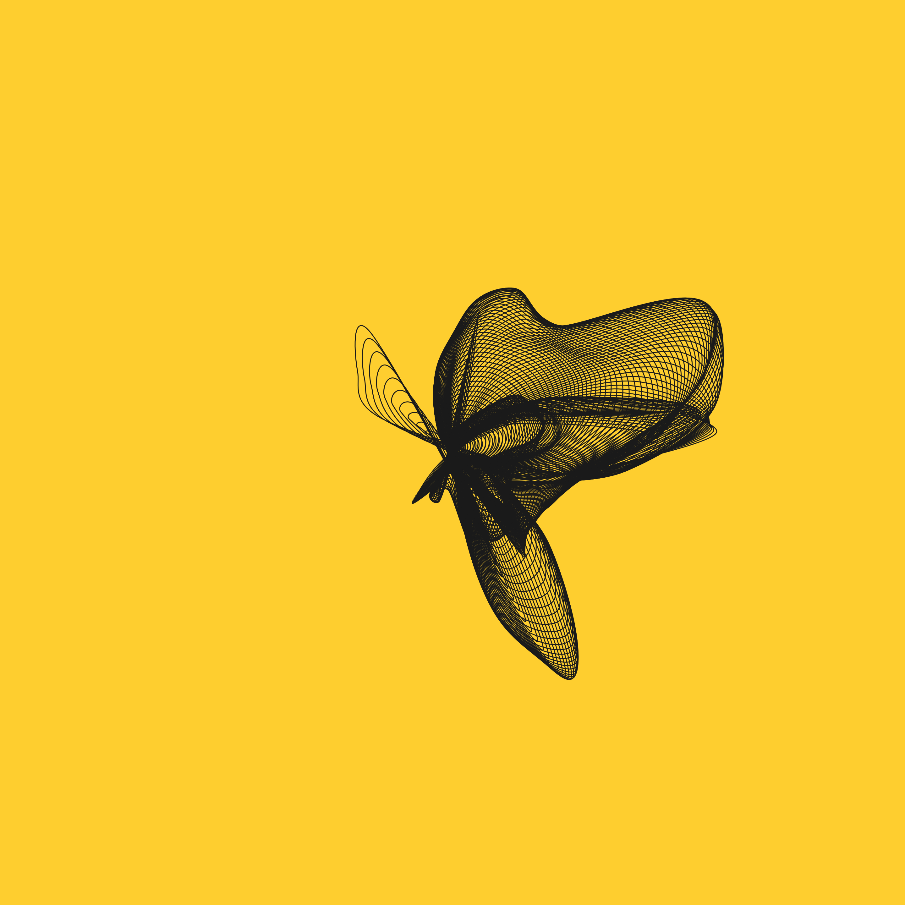
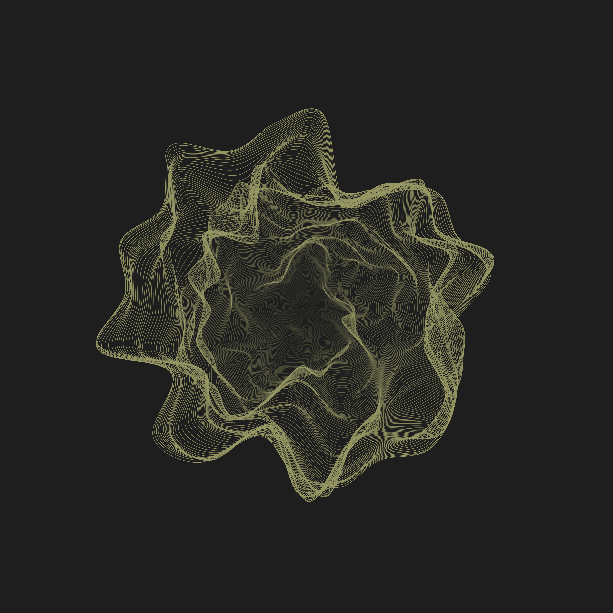
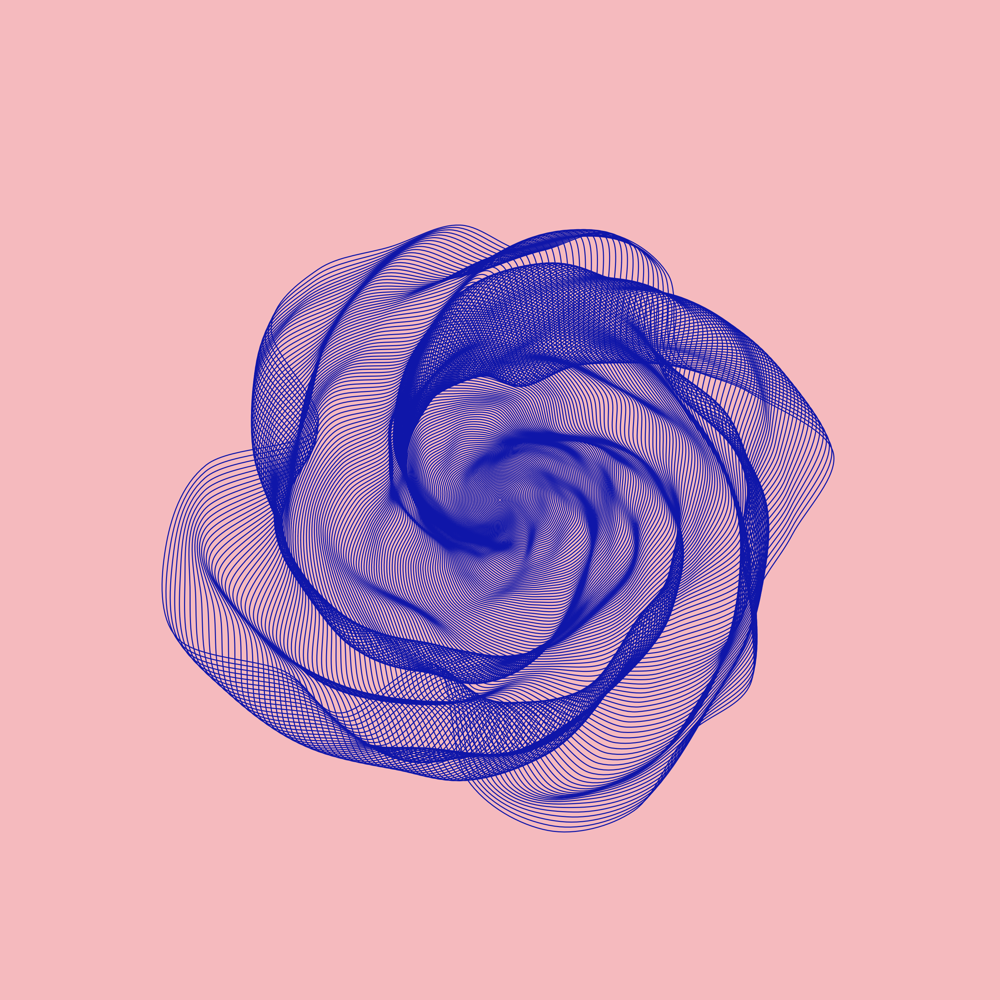

### [Dunes](./demos/hillsAndDunes/dunes.js)

Just plaing with moving around a sin wave (or to be precise the absolute value of a sin wave) laterally
while pushing it down. Again, offset and noise amplitude, as well as color and opacity, or even adding a bit
of "shadow" can lead to radically differnet results. Our favourite results are when the period of the oscillations are very large,
with the some light shadow and large noise. This creates some dreamy dunes.


### [Mantis](./demos/mantis/mantis.js)

This project started as a tree generator. When turning symmetry on, we realised that is generated shapes evoquing animal faces, and insects, 
with an African tribal mask feel to them. After a bit of tweaking, we managed to round off the "trees" to create smoother shapes. This mantis 
is a very nice example of a both minimal and yet rich piece.  

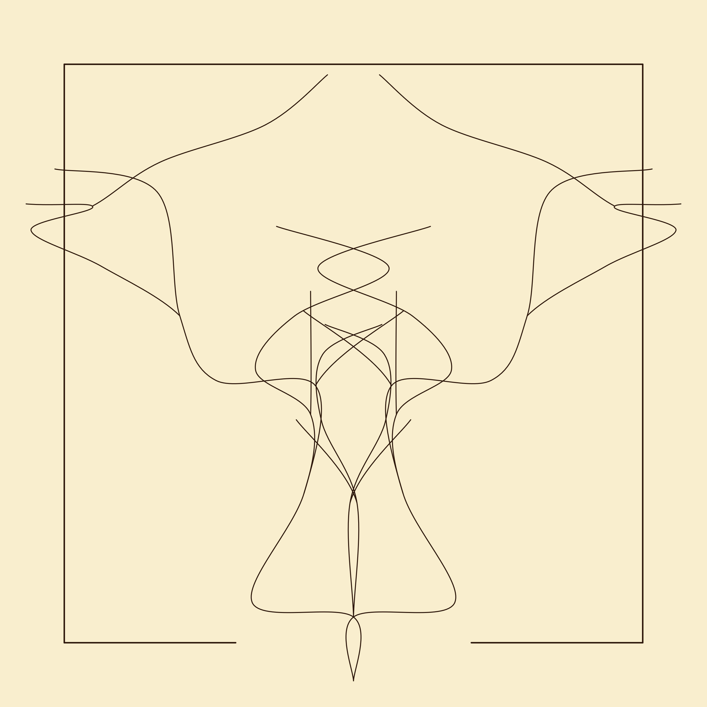

### [Perlin flow, Brain and Moon](./demos/perlinFlowField/perlinFlowField.js)

Scattering particles and letting them drift along some noise field is always very fun. Playing with noise type, noise transformation
(curl, distortion, ridging...) and amplitude of the noise field influence on the particles gives many different worlds to explore. Some examples include 
the "brain" and the "moon" below.


### [Ribs](./demos/ribs/ribs.js)

One of the early works we made, ribs is leveraging the need of the brain to see patterns. Playing on periodic opacity 
changes and width of some arcs, we managed to get this
peaceful work, which can be animated for great, almost trippy, effects.

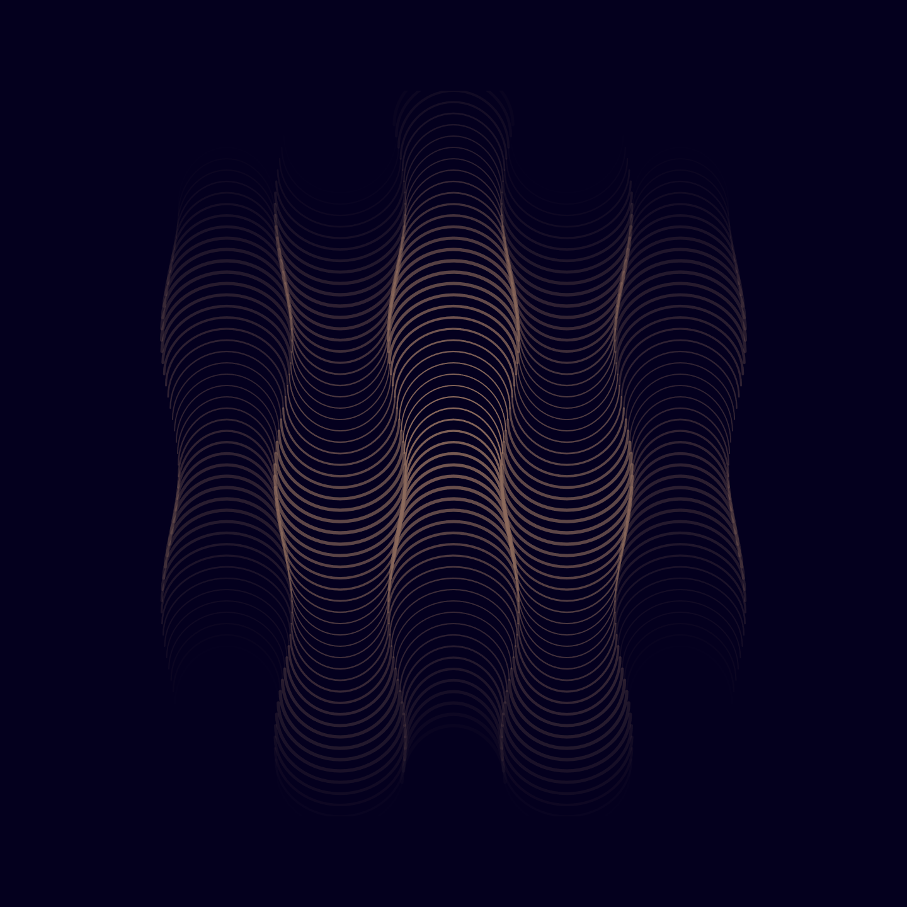

### [Sailors](./demos/sailors/sailors.js)

This work is inspired by the work of [Julien Gachadoat](https://www.instagram.com/p/CJqau6dHQRV/) who made very nice drawings where
a circle is suggested to the viewer by the addition of chaos under the form of sine waves. This work takes the revert approach where
each row of the image will receive a sine wave with increasing frequency as we go down the image. For each row the phase is randomized,
giving the effect of looking at the sea. Once this is done, each point along the sine wave has its position checked against some shapes,
in our case a collection of triangles and half shapes, and if the point is inside, it is flatten to the row height. Thius in turn draws a
small boat as the only peaceful point of focus in a sea of chaos.

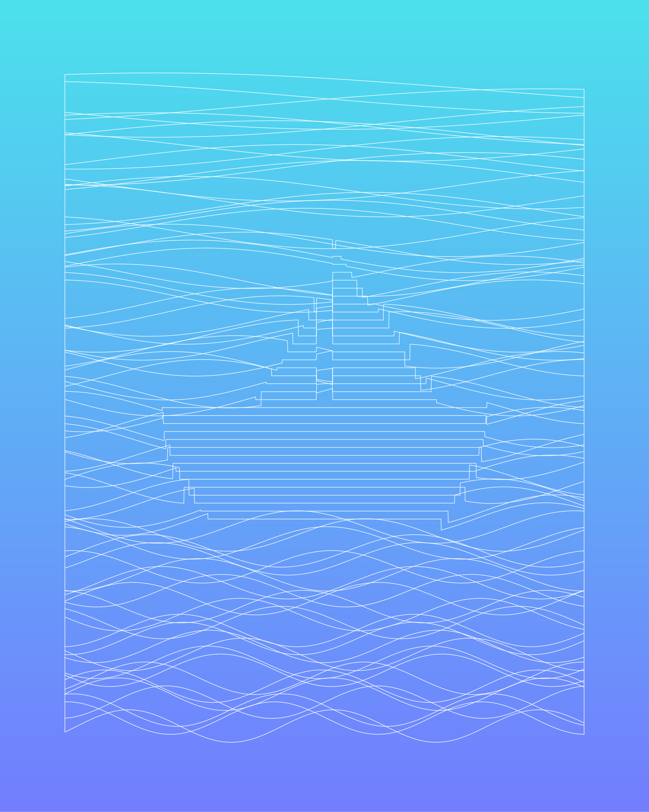

### [Sevilla](./demos/sevilla/sevilla.js)

One of the recurrent themes we like to explore with the Fresco.p5 library is that of distorting shapes with noise. Here, we draw strips of lines, 
displacing only the bottom half of the picture (we have added some fade to the displacment magnitude based on the pixels y coordinates to avoid so
harsh distortion line). The result is a motif which ressembles the erratic fabric movements of the flamenco dancers you can sometimes see in the 
streets of Sevilla.

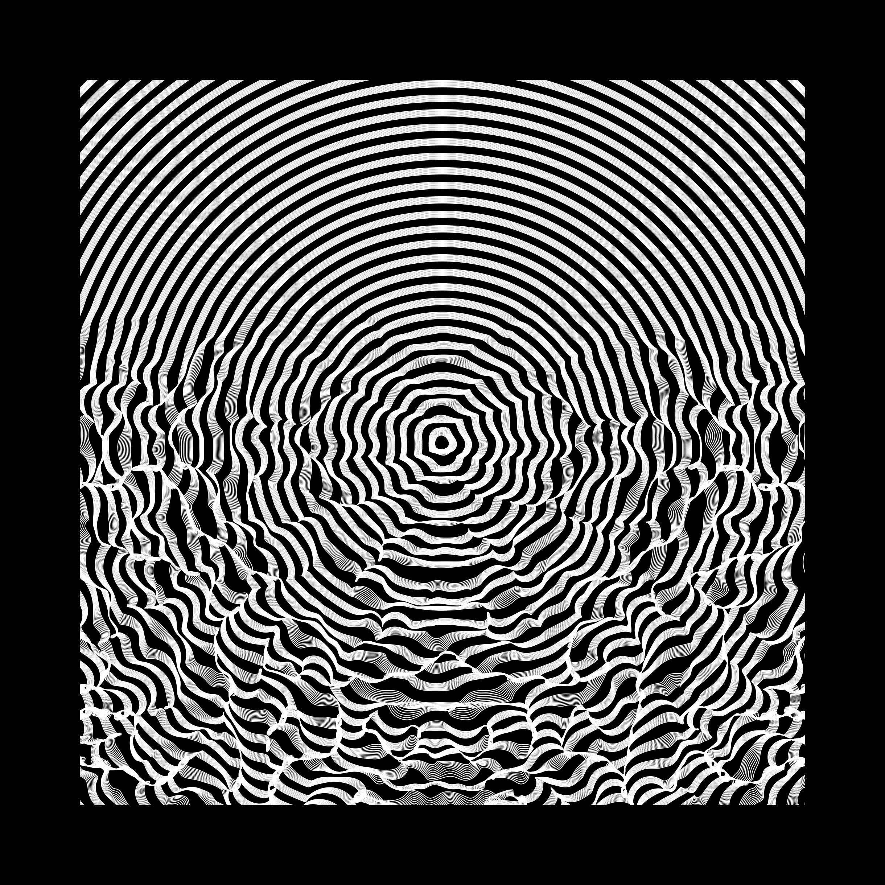

### [Theatre](./demos/theatre/theatre.js)

We wanted to try and draw a piece which resembles the old school theatre decor, with its waves and clouds hand crafted with papier maché, and,
always, some discernable love for the craft. For the clouds, we draw some rectangular giggly lines which we then round the corners off. Lots of
trial and error here went into making sure the clouds actually close correctly. Add some shadows, some concentric half circles for the waves, 
animated with some simple horizontal offset, and an extra particle system for some soft rain, and you get something which hopeffuly captures some
of the feeling of these old decors.

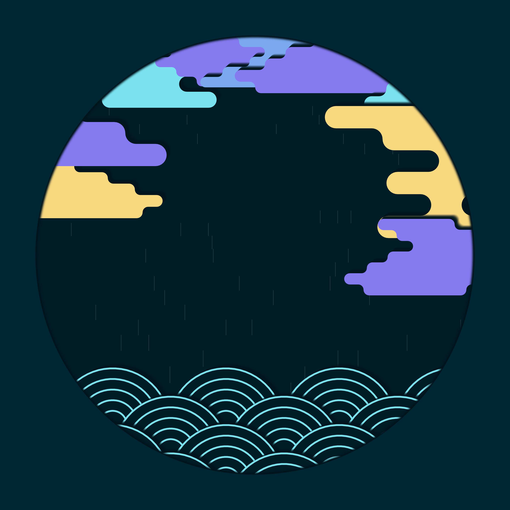
